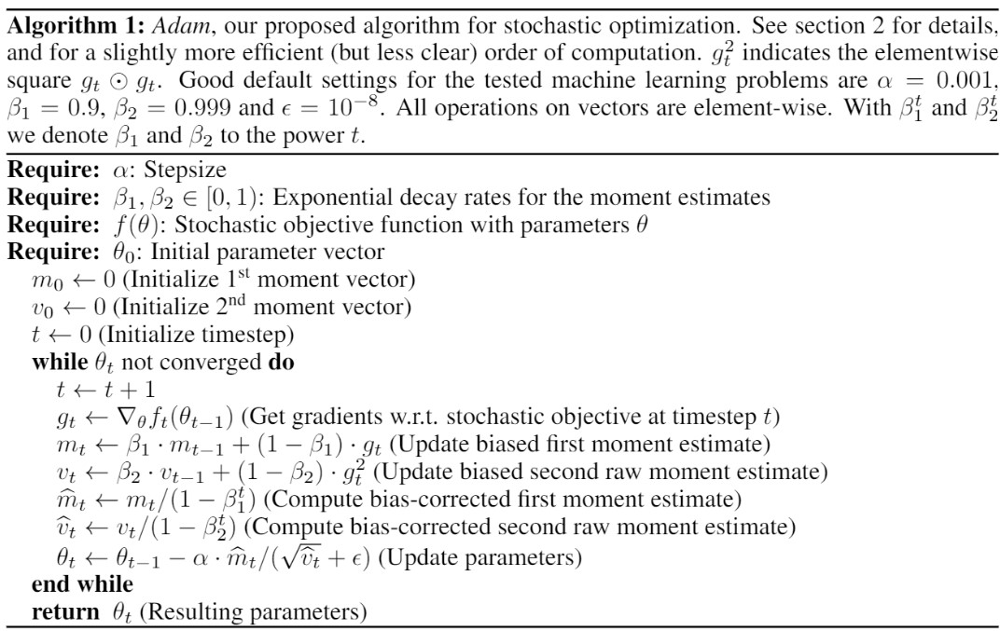
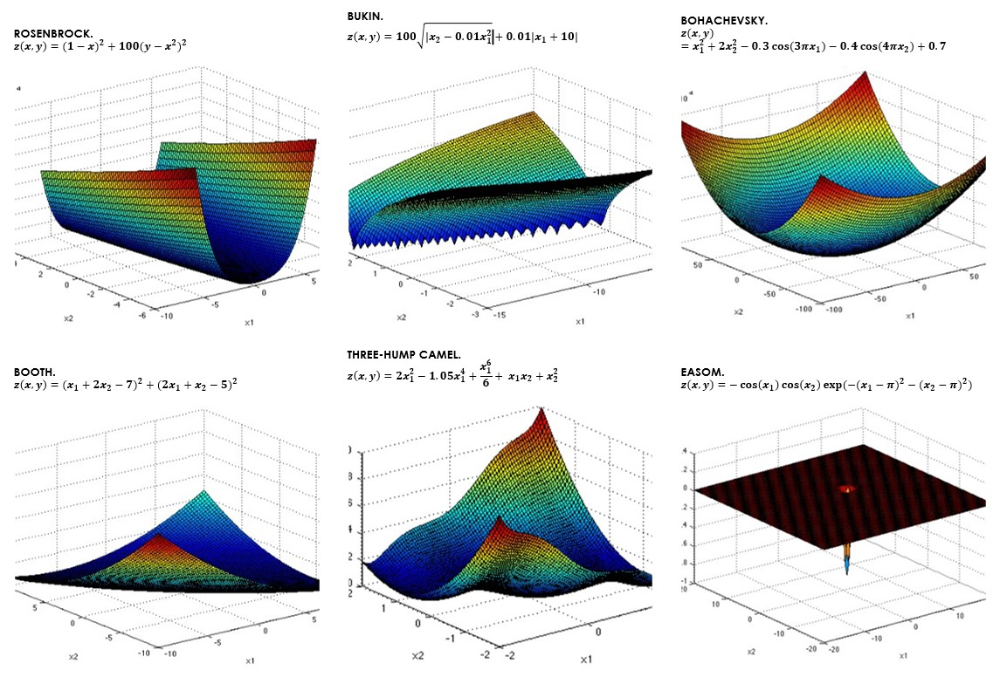

### **📉ADAM OPTIMIZATION FROM SCRATCH.**

*Purpose: Implementing the ADAM optimizer from the ground up with PyTorch and comparing its performance on 6 3-D objective functions (each progressively more difficult to optimize) against SGD, AdaGrad, and RMSProp.*

In recent years, the Adam optimizer has become famous for achieving fast and accurate results when it comes to optimizing complex stochastic loss functions - thanks to its moment estimates (as I'll explain further) and update rule, it is able to more efficiently converge to reliable local (and sometimes global) minima, and has been shown to perform remarkably well on high-dimensional objective functions due to **a very small memory requirement - the optimization method is invariant to gradient scaling and does NOT need to compute higher order derivatives, thus making it more computationally efficient.**

The goal of this project is to 1️⃣ learn how optimization methods work mathematically and their theoretical behaviour (reading and taking notes on the paper + building a strong foundation of statistics), 2️⃣ apply this theoretical knowledge by constructing said optimizer from scratch in PyTorch (found in `CustomAdam.py`), and 3️⃣ test this custom implementation on six 3D functions against optimizers to determine performance. The objective of this last step was to see if I could **leverage the mathematical knowledge gained in a) to improve the optimizer. (Optimizer_Experimentation.ipynb).** 

This project was started in an effort to replicate the original 2017 paper! Check it out for more information and a more detailed explanation of how everything works under the hood - https://arxiv.org/pdf/1412.6980.pdf.

### **➗ How Adam Actually Works - The Math.**

**Fundamentally, the core aspect of ML that allows machine to "learn" is optimization** - taking a differentiable objective (loss) function and attempting to intelligently modify the model's parameters in such a way that it results in a lower (or higher) value of this function. This is done iteratively - the optimization algorithm uses something known as the **gradient** (simply the derivative of the loss function at that point) to determine how best to update all the parameters. Each one of these updates/iterations is known as a **"step"**, and over a large number of steps, the model should ideally **converge to a local minima that offers arbitrarily good parameters.** The *size* of these steps is known as the *stepsize or learning rate*, as we'll go over next.

Here's a quick GIF using the standard SGD (Stochastic Gradient Descent) Optimization Algorithm (source: https://mlfromscratch.com/optimizers-explained/):

</img>

**The key disadvantage of this method is that it becomes computationally expensive extremely fast.** The image above showed a model with one parameter being optimized - but, practically, most models have **dozens if not hundreds of thousands of parameters** that must be optimized. In such cases, we have to compute the **nth order derivative of some cost function $Z(θ)$** where $θ$ is a vector of all of these parameters - a task that must be repeated **for each step we take.** This quite evidently slows down the optimization process and drastically increases the compute needed as well.

How does Adam fix this? *By using first and second moment ESTIMATES to update parameters rather than the gradient themselves.* 

(**Quickly, here are some terms worth noting:**

- **Expected Value:** this is given by $E[X]=∫^∞_{-∞}x*p(x)dx$, and its fundamental goal is to represent **the return you can obtain for performing some action.** In this case, $p(x)$ is the probability distribution of some random variable, and *x* is the variable itself. All in all, this gives the probability that some random event will occur.

- **First Moment:** this is given by $E[X]$, and simply yields the mean value of the given data.

- **Centered and Uncentered Moments:** the formula given for the expected value involves an integral; but, we can **APPROXIMATE THIS MOMENT WITH A SUM**, much like any integral can be approximated via a left or right Riemann sum. In that case, we simply do $prob * var + prob * var...$ for all the different probabilities and variables. This is known as the **uncentered** or raw moment. If we subtract the *mean from each and every variable value then we get the CENTERED moment.* Mathematically, it a centered moment would be yielded by $prob * (var - mean) + prob * (var - mean)...$ for all $n$ variables.

- **Second Moment (UNCENTERED AND CENTERED):** The second moment is the same as the first moment, except for the fact that **every $x$ term is SQUARED.** So, the actual formula for a moment is $m_n=E[X^n]$, where $n$ refers to the given moment (first, second, etc.). The **second CENTERED MOMENT is the variance, whereas the second UNCENTERED moment is the uncentered variance or SQUARED DISTANCE FROM THE ORIGIN.** 

*P.S. - while there isn't enough room here to give full proofs of all of this, I've broken down the math for myself as I was learning it all in one spot https://crysta.notion.site/ADAM-A-METHOD-FOR-STOCHASTIC-OPTIMIZATION-758a789b929842d4ac01281e4366f9f5; check it out and scroll to the "Key Terms" section for a more detailed set of definitions*.)

By using these moment estimates, Adam is able to circumvent the high compute and training time for traditional optimization methods on high dimension problems. 

**Here's an exact breakdown of the algorithm:**

1. **Initialize zero-filled tensors** for the first moment estimate $m_0$ and the second uncentered moment estimate $v_0$, and set timestep $t$ (which keeps track of what iteration we are on) to zero.

(Repeat the following steps until converged)

2. **Increment timestep** ($t = t+1$).

3. **Obtain the gradients:** $g_t = ∇f_t(θ_{t-1})$ where f_t is the loss function, θ is the parameter vector and ∇ represents the act of taking the gradients (partial derivatives as we have more than one parameter; the derivative of a vector is known as a partial derivative) of the specified cost function. 

4. **Use a bias to estimate the first moment across all the gradients:** $m_t = B_1 * m_{t-1} + (1 - B_1) * g_t$. When optimizing, we want to limit the influence of outliers and one-off exploding gradients as much as possible - if the new gradient vector is substantially different than the existing ones, then we want to take the past vectors into consideration so as not to make disastrous, radically different updates. So, we add a **bias term to circumvent this - this bias decays exponentially as we progress**, thanks to the next couple of steps.

5. **Estimate the second uncentered moment.** Same philosophy as the above step, but this time $v_t$ is being updated and we are taking the **SQUARE OF THE GRADIENT** since we're computing the estimate of the second raw moment: $v_t = B_2 * (v_{t-1}) + (1 - B_2) * g_t^2$.

    - Note that this equation is a moment estimate - $B_2$ acts as a probability, and $v_{t-1}$ and $g_t^2$ act as the "random" variables ($P(x)$ and $x$ in the expected value equation). The second uncentered moment requires that we *square each X*, which is thus why $g_t$ is squared.

6. **Correct the bias introduced in the first moment estimate:** $m^{Δ}_t=m_t/(1-B_1^t)$. I won't go into too much detail into why exactly we need to do this here, but it's relatively simple - as mentioned earlier, our "sum" method is an approximation of the moments instead of the true moment (which would be found by taking the integral in the expected formula). If we take the integral of the above formula to find $E[v]$, we are left with $E[g] * (1 - B_2) + C$, meaning that we are a factor of $1 - B_2$ off from the true second raw moment $E[g]$. **So, simply divide the moment estimate** $m_t$ by $1 - B_2$ **to correct for the added bias - yielding** $m^Δ$. Furthermore, note that we are dividing by 1 minus the *bias raised to the power 2.* This is, in essence, decaying the bias and **shrinking** $m^Δ$ **as** $t$ **(our current step) grows larger and larger.**

7. **Correct the bias introduced in the *second* uncentered moment estimate:** $v_t^{Δ}=v_t/(1-B_2^t)$. Exact same principle as step #6, but applied to $v_t$.

8. **Update the parameters:** $θ_t=θ_{t-1} - \frac{α}{√(v^Δ_t)+ε} * m^Δ_t$. Let's break this down:
    - $α$ represents the stepsize. This, along with $\frac{a(1-B_1)}{√(1-B_2)}$, serve as the upper bound for the effective step that the optimizer can take. For more depth on this, checkout the "Information about the algorithm" section in my Notion link above, or the original paper.

    - $m_t^Δ$ represents the first moment bias-corrected moment estimate computed in step 7.

    - $v_t^Δ$ represents the second uncentered bias-corrected moment estimate computed in step 6.

    - $ε$ is an arbitrary constant (usually 10e-8) added in the denominator to avoid division by zero. We'll be ignoring this in the next analyses, as its extremely small size makes it effectively irrelevant when taking a step.

    Why are we multiplying $ α $ with $\frac{m^Δ_t}{√(v^Δ_t)}$ ? Note that the latter is, roughly speaking, the first moment divided by the second moment - the mean divided by the mean distance from the origin. Furthermore, $v^Δ$ yields the AVERAGE SQUARED DISTANCE from the origin (it would yield avg. sq. distance from the mean if the moment was centered), and thus the square root is needed to yield the raw avg. sq. distance from the origin.

    **In the paper, this expression** ($\frac{m^Δ_t}{√(v^Δ_t)}$) **is known as the *signal to noise ratio*.** The idea is that we want to REDUCE the stepsize if we are more unsure of what the ideal step would be - meaning that that the value of the factor that we multiply the stepsize with should be *closer to zero/have a larger denominator* if there is more *variability* across the gradient estimates. More specifically, **if the gradients have more spread w.r.t the origin despite the mean being SMALL (0), then this indicates that there is high degree of uncertainty** - and, as the mean and the spread w.r.t the origin are both the first moment and the second uncentered moment respectively, the SNR will be a much smaller value as the denominator grows larger than the numerator. If both are high, then this means there is a strong signal for an update in a certain direction (**meaning that the SNR should be closer to one and thus allow for a step of the full stepsize**). 

    Fundamentally, this is a form of **stepsize annealing** - the step size is adjusted **dynamically and grows smaller and smaller as we begin approaching a minima and the gradients begin to shrink.**

Here's a full picture of all of these steps summarized (as presented in the paper):

</img>

### **🧪 Method and About This Experiment.**

There are two key components to this repository - the custom implementation of the Adam Optimizer can be found in `CustomAdam.py`, whereas the experimentation process with all other optimizers occurs under Optimizer_Experimentation.ipynb. **Each optimizer is ran for 60k steps for each function(replicating one full pass through of the MNIST-dataset as performed in the Adam paper).**

The experiment setup was made in an effort to determine the performance of the custom Adam implementation against the more commonly used methods. Specifically, the experiment runs CustomAdam, SGD, RMSProp, and AdaGrad on 6 3-Dimensional functions (with each using the same weight initializations between ±1), each of which pose unique challenges.

Here are the six functions used in this experiment, along with a diagram and key challenges. (diagram made in PowerPoint, source for these images and equations https://www.sfu.ca/~ssurjano/optimization.html)

</img>

There are **two key classes that make this experiment possible** - `LossFunctions`, which consists of one method for each of the above functions (each of these methods computes the listed equation with `torch` operations), and `OptimizerTest`, which tests the given optimizer against the functions specified in `Lossfunctions` and instantiates a separate instance of each optimizer for each experiment to reset the input parameters (each instance of an optimizer should be used to optimize just one function as a best practice to avoid different parameters being used for each test).

**All optimizer points and results are stored inside dictionaries for plotting the end results, as seen in `Optimizer_Experimentation.py`*.

### **🎯 The Results.**

Interestingly, the performance of all optimization functions varied wildly across all trials (test was repeated 5+ times to ensure that similar trends were taking place).

Here are the results. Note that **all results are shown in symmetrical logarithmic scale.**

</img>

Interestingly, the CustomAdam implementation is largely successful in solving virtually all the posed optimization problems. While its speed of optimization tends to be around 10-50 steps later than RMSProp (which seems to have the best performance overall when considering performance across all functions), it appears to be better at avoiding local minima (as given by its non-oscillation and rapid convergence with regards to the Bukin test).

Of particular interest are the Bukin and Easom functions. As visible in the function diagrams of the previous section, the Bukin function consists of hundreds and hundreds of local minima arranged in a kind of "ridge" shape - meaning that if an optimizer were to get stuck in one of these local minima, it would (depending on the learning rate) begin rebounding along the edges and generate a rapidly oscillating function. That certainly is one explanation for why both RMSProp and SGD appear to form discrete "chunks" caused by rapid oscillation over 60k steps.

However, that is not the full story - as the scale is logarithmic, it means that the difference between the peak and trough of the RMSProp oscillation is an order of magnitude smaller than the same difference of the SGD oscillation. In other words, **SGD fluctuates between 1 and 100, whereas RMSProp fluctuates between near-zero and 1.** This indicates that **despite having the same general pattern of repeated oscillation, RMSProp was able to find a local minima, whereas SGD was simply unable to converge.** A potential reason for this may be the tendency of SGD to get "trapped" inside local minima - RMSProp introduces exponential decay rates which prevents steps from becoming inconsequential too quickly, a problem that often plagues optimizers by the likes of AdaGrad due to excessive learning rate decay (see the original papers for said optimizers for more information on why exactly this is). Both CustomAdam and AdaGrad were able to converge without any (visible) oscillation. 

Regarding the Easom function, **no optimizer except AdaGrad** was able to converge here - given that the Easom function is effectively uniform with the exception of one gargantuan trough, this was to be expected. AdaGrad in particular aims to update sparse features more often than already updated ones; helping to strengthen the probability that the step taken was the most optimal not just regarding the immediate surroundings, but in the context of a certain range. Ultimately, this aids AdaGrad in making better and more "informed" steps towards minima.

While the CustomAdam implementation converged faster in the more complex Bukin function, it speed of convergence lagged behind those of RMSProp and AdaGrad. Empirical evidence suggests some reasons for this - whereas the exponential moving averages (moment estimates) used in Adam prevent against excessive stepsize decay by weighting new gradients higher than previous one, it is often **rare in practice that these new gradients are large enough to provide meaningful signals - and in cases that they do, exponential decay makes it so that they become nearly irrelevant after just a certain number of steps (thus hindering convergence).** This is particularly the case with **nonconvex optimization problems**, such as the aforementioned Easom function - and explains how **AdaGrad (which has no decay) was able to converge, whereas decay-based optimization methods such as the CustomAdam implementation and RMSProp both failed to converge.** Further empirical evidence has also shown that **Adam and adaptive gradient descent techniques can, in high-parameter models, generalize *worse on average than simply using SGD!***

(Here are the papers describing these effects: https://openreview.net/forum?id=ryQu7f-RZ, http://www.cs.toronto.edu/~sajadn/sajad_norouzi/ECE1505.pdf)

All in all, there is certainly tremendous room for further growth and exploration in the performance of these optimizers - in fact, several new optimizers have arisen in recent years to address the aforementioned problems. 

🪜**Next steps involve:**
 - Testing on higher dimensional functions to determine if the theoretical memory benefits of Adam hold up, 
 - Attempting to solve the above problems by creating a new optimizer from scratch, and 
 - Testing said functions on more non-convex functions.

### 🔑 Key Learnings.

1. 🏛️**The inner workings of optimizers and statistics fundamentals, from both a theoretical and practical perspective.** Reading through the original Adam paper, taking notes, and re-implementing the optimizer combined gave me a stronger intuition about the nature of optimization functions and the mathematics behind parameter tuning than any one of those things could have taught me individually. The theoretical aspect aided in solidifying why it was that Adam actually worked (key proofs and formulas that explained common real-world occurrences), whereas the practical aspect better acquainted me with how libraries such as PyTorch work in the backend (leaf tensors and views) and **important practical considerations when converting a theoretical optimizer into raw flesh and blood.**

2. 📊**Why certain optimizers converge better than others.** As mentioned in the results section, simple things such as exponential decay can drastically influence the ability of optimization methods to converge; and allow more simple optimizers to sometimes perform better than adaptive methods. On the other hand, these same simple optimizers (SGD without momentum in particular) have a greater tendency to get stuck in local minima.  As usual, it appears that **the best solution may lie in ensembles of optimizers as opposed to relying on just one method - combining the pros of each to obtain the best of each world.**
   
3. 🧪 **Best practices in terms of validating optimization methods** - or, the importance of using non-convex and local-minima-riddled functions to test optimizers. These types of functions often highlight discrepancies and major faults/weaknesses between various methods and can help open the floor for further analysis (as was the case under the results section).

All things considered, this project 10x-ed my understanding of the mathematics behind machine learning and revealed interesting problems in terms of both tuning hyperparameters and optimizing parameters on high-dimensional functions. Excited to see what comes next!

*Special thanks to Diederik P. Kingma and Jimmy Lei Ba for writing the original paper! Very fascinating read and was a blast to replicate.*